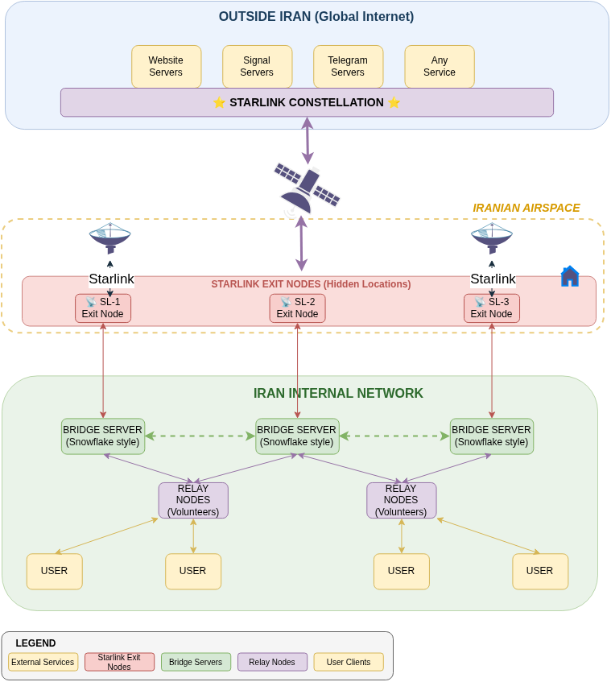
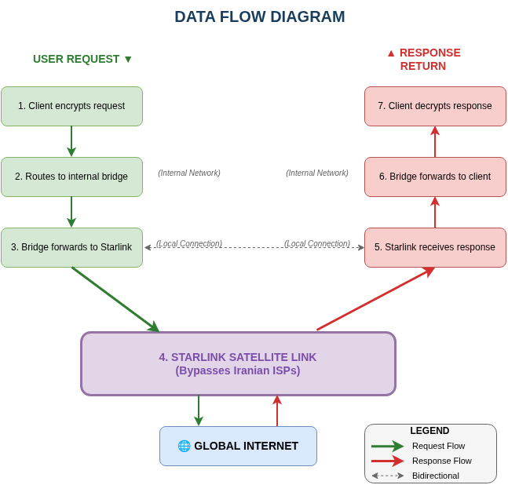
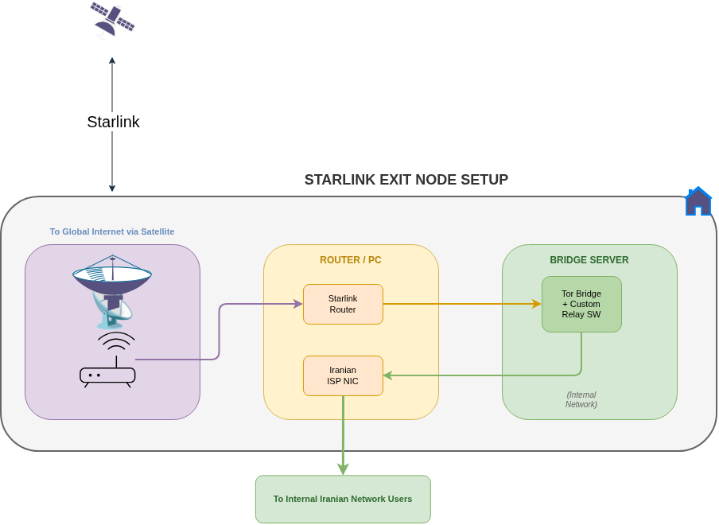
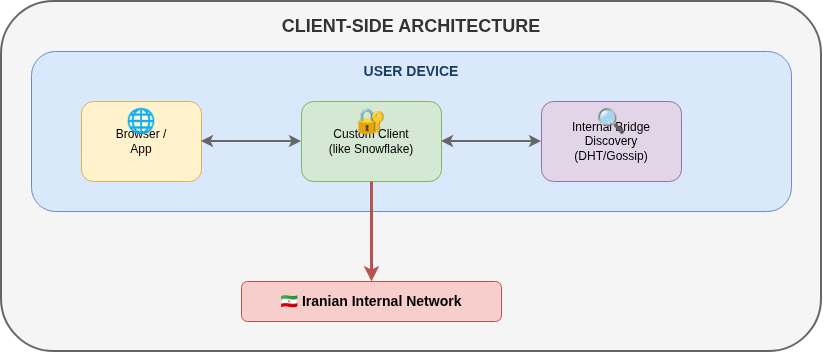
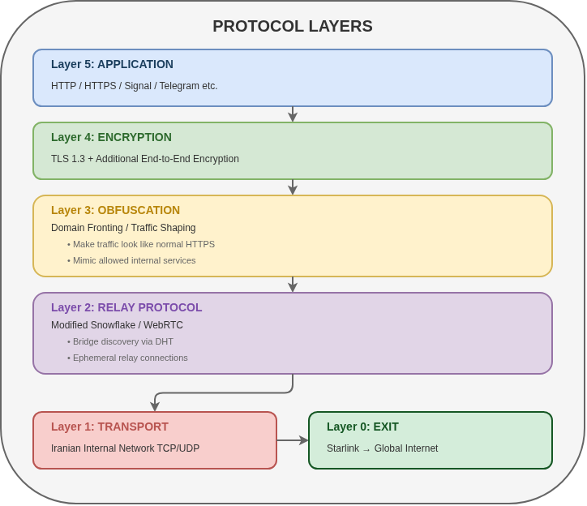

<div dir="rtl">

# جاویدنت

</div>

<div align="center">

```
     ██╗ █████╗ ██╗   ██╗██╗██████╗ ███╗   ██╗███████╗████████╗
     ██║██╔══██╗██║   ██║██║██╔══██╗████╗  ██║██╔════╝╚══██╔══╝
     ██║███████║██║   ██║██║██║  ██║██╔██╗ ██║█████╗     ██║
██   ██║██╔══██║╚██╗ ██╔╝██║██║  ██║██║╚██╗██║██╔══╝     ██║
╚█████╔╝██║  ██║ ╚████╔╝ ██║██████╔╝██║ ╚████║███████╗   ██║
 ╚════╝ ╚═╝  ╚═╝  ╚═══╝  ╚═╝╚═════╝ ╚═╝  ╚═══╝╚══════╝   ╚═╝
```

**اینترنت موازی ساخته شده از دیش‌های ماهواره‌ای، رادیوهای مش و رادیو HF**

[](https://opensource.org/licenses/MIT)
[]()
[]()

</div>

<div dir="rtl">

**[English](README.md)**

---

## جاویدنت چیست؟

وقتی دولت اینترنت را قطع می‌کند، ابزارهای دور زدن فیلتر از کار می‌افتند. VPN، پروکسی، بریج تور، همه به زیرساخت دولت وابسته‌اند. لوله‌ها را ببندی، هر چیزی که داخل لوله‌ها کار می‌کند می‌میرد.

جاویدنت داخل لوله‌ها کار نمی‌کند.

جاویدنت یک **اینترنت موازی** است، جایگزین کامل شبکه داخلی. دو کانال ارتباطی مستقل دارد:

1. **شبکه مش استارلینک** - دیش‌های ماهواره‌ای + رادیوهای مش محلی (Wi-Fi، BLE، LoRa) برای دسترسی اینترنت بلادرنگ
2. **ارتباط رادیو HF** - رادیو موج کوتاه از طریق انعکاس یونسفری برای پیام متنی و ایمیل وقتی حتی ماهواره هم در دسترس نیست

ترافیک هیچگاه به زیرساخت دولت نمی‌رسد. چیزی برای مسدود کردن نیست، چیزی برای فیلتر نیست، چیزی برای کند کردن نیست.

## معماری



سیستم سه منطقه دارد:

**اینترنت آزاد** - وب‌سایت‌ها، سرویس‌های پیام‌رسانی (سیگنال، تلگرام)، سرورهای ایمیل. همه چیزی که از طریق اینترنت جهانی قابل دسترسی است.

**منطقه ماهواره‌ای** - دیش‌های استارلینک مخفی متصل به نودهای دروازه. اینها نقاط خروج جاویدنت به اینترنت آزاد هستند. هر دروازه شامل کش محتوا، حل‌کننده DNS، شکل‌دهنده ترافیک و سیستم عدالت پهنای باند است.

**منطقه مش** - شبکه رادیویی محلی که کاربران را به نزدیک‌ترین دروازه متصل می‌کند. کاربران یک پروکسی SOCKS5 روی دستگاه خود اجرا می‌کنند. ترافیک از دستگاهی به دستگاه دیگر در مش پرش می‌کند تا به دروازه ماهواره‌ای برسد.

اینترنت دولت در هیچ نقطه‌ای از این زنجیره استفاده نمی‌شود.

## جریان داده



یک درخواست وب از هفت مرحله عبور می‌کند:

1. کلاینت درخواست را رمزگذاری می‌کند
2. به پل داخلی از طریق مش مسیریابی می‌شود
3. پل به دروازه استارلینک ارسال می‌کند
4. لینک ماهواره‌ای استارلینک (تمام زیرساخت داخلی را دور می‌زند)
5. استارلینک پاسخ را از اینترنت دریافت می‌کند
6. پل پاسخ را به کلاینت ارسال می‌کند
7. کلاینت پاسخ را رمزگشایی می‌کند

## راه‌اندازی نود خروجی



هر نود خروجی شامل یک دیش استارلینک، یک روتر/رایانه و نرم‌افزار سرور پل است. روتر دو رابط شبکه دارد: یکی متصل به دیش استارلینک (آپلینک ماهواره‌ای) و یکی متصل به شبکه داخلی (برای دریافت ترافیک مش از کاربران).

## معماری سمت کلاینت



در سمت کاربر، یک برنامه کلاینت سفارشی (مشابه Snowflake) روی دستگاه اجرا می‌شود. از طریق یک رابط پروکسی محلی به مرورگر/برنامه متصل می‌شود و پل‌های داخلی را از طریق پروتکل DHT/Gossip کشف می‌کند.

## لایه‌های پروتکل



| لایه | عملکرد | فناوری |
|------|--------|--------|
| ۵ | برنامه | HTTP/HTTPS، سیگنال، تلگرام |
| ۴ | رمزگذاری | TLS 1.3 + رمزگذاری سرتاسری |
| ۳ | مبهم‌سازی | شکل‌دهی ترافیک، domain fronting |
| ۲ | رله | Snowflake/WebRTC اصلاح شده |
| ۱ | انتقال | TCP/UDP شبکه داخلی |
| ۰ | خروج | استارلینک به اینترنت جهانی |

## دو کانال ارتباطی

### ۱. شبکه مش استارلینک

کانال اصلی. شبکه مش از دیش‌های ماهواره‌ای و رادیوهای محلی که دسترسی اینترنت بلادرنگ را برای هزاران کاربر به طور همزمان فراهم می‌کند.

سه نوع نود کل سیستم را تشکیل می‌دهد:

| نقش | کار | سخت‌افزار |
|-----|-----|----------|
| **LEAF** | کاربر نهایی. پروکسی SOCKS5 روی `127.0.0.1:1080` | هر گوشی/لپ‌تاپ |
| **HOP** | ترافیک را بین نودها رله می‌کند. برد مش را افزایش می‌دهد | هر دستگاه با Wi-Fi |
| **GATEWAY** | دیش استارلینک دارد. خروجی به اینترنت واقعی | RPi + دیش استارلینک |

مفهوم و دلایل طراحی: **[شبکه مش استارلینک - مفهوم](STARLINK_MESHNETWORK_README.fa.md)** ([English](STARLINK_MESHNETWORK_README.md))

کد منبع و راهنمای استفاده: **[starlink-meshnetwork/](starlink-meshnetwork/README.fa.md)** ([English](starlink-meshnetwork/README.md))

### ۲. ارتباط رادیو HF

کانال پشتیبان. از رادیو موج کوتاه (۳ تا ۳۰ مگاهرتز) و انتشار موج آسمانی یونسفری استفاده می‌کند تا پیام متنی و ایمیل را در فواصل ۱۰۰۰ تا ۴۰۰۰ کیلومتر ارسال کند، بدون هیچ وابستگی به زیرساخت زمینی.

امواج رادیو HF از یونسفر (لایه F2، ارتفاع حدود ۳۰۰ کیلومتر) بازتاب می‌شوند و صدها یا هزاران کیلومتر دورتر فرود می‌آیند. یک کاربر در تهران می‌تواند به دروازه‌های ایمیل Winlink در ترکیه، ارمنستان، امارات، کویت و فراتر از آن دسترسی پیدا کند، تنها با یک رادیو ۵ تا ۱۰ وات و یک آنتن سیم نازک.

نیازی به اینترنت در مکان فرستنده نیست. دروازه در کشور همسایه اینترنت دارد و پیام‌ها را به مقصد نهایی ارسال می‌کند.

جزئیات کامل و نمودارهای فنی: **[مستندات رادیو HF](hf-radio-diagrams/README.fa.md)** ([English](hf-radio-diagrams/README.md))

## تخمین ظرفیت

### مش استارلینک

| دیش | پیام‌رسانی | مرور بهینه | مرور عادی |
|-----|-----------|-----------|----------|
| ۱ | ۵۰,۰۰۰ کاربر | ۲,۰۰۰ کاربر | ۲۰۰ کاربر |
| ۵ | ۲۵۰,۰۰۰ کاربر | ۱۰,۰۰۰ کاربر | ۱,۰۰۰ کاربر |
| ۱۰ | ۵۰۰,۰۰۰ کاربر | ۲۰,۰۰۰ کاربر | ۲,۰۰۰ کاربر |

این تخمین‌ها با فرض بهینه‌سازی تهاجمی محتوا و کش هستند. اعداد واقعی به الگوی مصرف و نرخ cache hit بستگی دارد.

### رادیو HF

| حالت | سرعت | کاربرد |
|------|-------|--------|
| VARA HF | ۲۰۰ تا ۲۰۰۰ بیت بر ثانیه | ایمیل، پیام کوتاه |
| ARDOP | ۲۰۰ تا ۵۰۰ بیت بر ثانیه | ایمیل، پیام کوتاه |
| JS8Call | حدود ۵۰ بیت بر ثانیه | متن کوتاه، بیکن |
| FT8 | حدود ۵ بیت بر ثانیه | تایید سیگنال فقط |

رادیو HF جایگزین اینترنت پرسرعت نیست. خط نجات برای ارتباط متنی وقتی همه چیز دیگر قطع شده.

## نصب

```bash
git clone https://github.com/user/javid-net.git
cd javid-net/starlink-meshnetwork
pip install -r requirements.txt
```

تنها وابستگی اجباری: `cryptography` (برای Curve25519 + Ed25519). بقیه Python خالص یا اختیاری.

## استفاده

```bash
# کاربر عادی (اتصال و مرور)
python javidnet.py leaf --socks-port 1080

# رله (کمک به رسیدن ترافیک به دروازه‌ها)
python javidnet.py hop

# اپراتور دروازه ماهواره‌ای
python javidnet.py gateway --cache-size 2000 --max-sessions 200
```

سپس برنامه‌ها را تنظیم کنید:

| برنامه | تنظیمات |
|--------|---------|
| Firefox | Settings > Network > Proxy > SOCKS5 `127.0.0.1:1080` |
| Chrome | `--proxy-server=socks5://127.0.0.1:1080` |
| Telegram | Settings > Data > Proxy > SOCKS5 `127.0.0.1:1080` |
| Signal | از پروکسی سیستم استفاده می‌کند |
| curl | `curl --proxy socks5h://127.0.0.1:1080 https://example.com` |

## مشارکت

از مشارکت این افراد استقبال می‌کنیم:

- **مهندسان شبکه** - طراحی پروتکل، بهینه‌سازی
- **محققان امنیت** - مدل‌سازی تهدید، تست نفوذ
- **توسعه‌دهندگان نرم‌افزار** - توسعه برنامه کلاینت/سرور
- **سازندگان سخت‌افزار** - طراحی آنتن، ساخت رابط رادیویی
- **مترجمان** - گسترش مستندات به زبان‌های بیشتر
- **اپراتورهای رادیو آماتور** - راه‌اندازی دروازه Winlink، تست HF

## سلب مسئولیت

این مخزن شامل **پیشنهاد فنی و سند بحث** است. اطلاعات ارائه شده برای اهداف آموزشی و تحقیقاتی است.

- اجرا ممکن است در برخی حوزه‌های قضایی غیرقانونی باشد
- کاربران و اپراتورها تمام ریسک‌ها را می‌پذیرند
- نویسندگان هیچ ضمانتی نمی‌دهند و هیچ مسئولیتی نمی‌پذیرند
- همیشه قبل از هر اقدامی قوانین محلی را بررسی کنید
- امنیت شخصی را بالاتر از همه چیز قرار دهید

این پروژه با انگیزه حق اساسی بشر برای دسترسی به اطلاعات و ارتباط آزادانه، طبق ماده ۱۹ اعلامیه جهانی حقوق بشر، ایجاد شده است.

## مجوز

این پروژه تحت مجوز MIT منتشر شده است. فایل [LICENSE](LICENSE) را ببینید.

---

<div align="center">

**در تاریکی، یک چراغ کافیست.**

</div>

</div>
