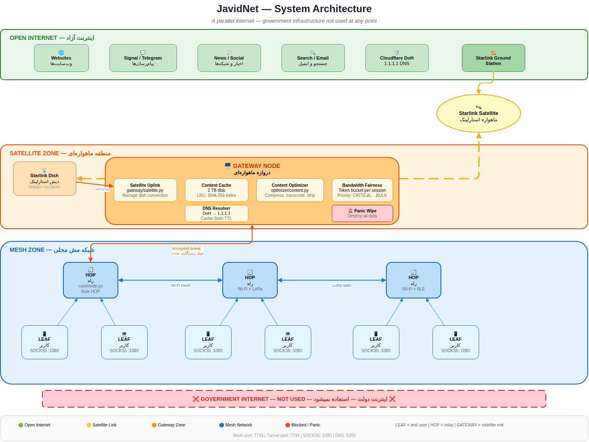
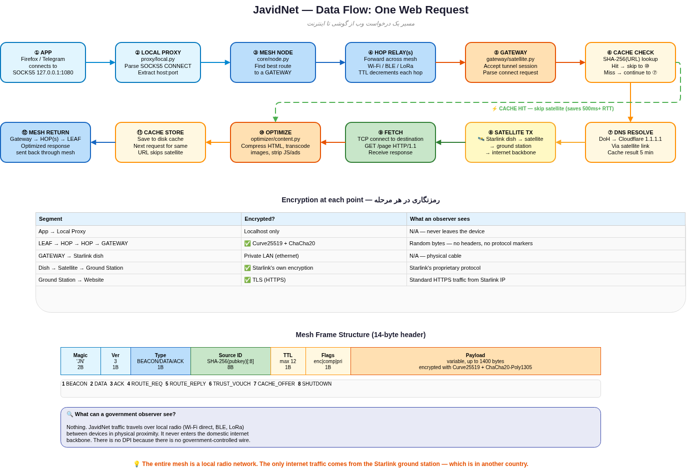
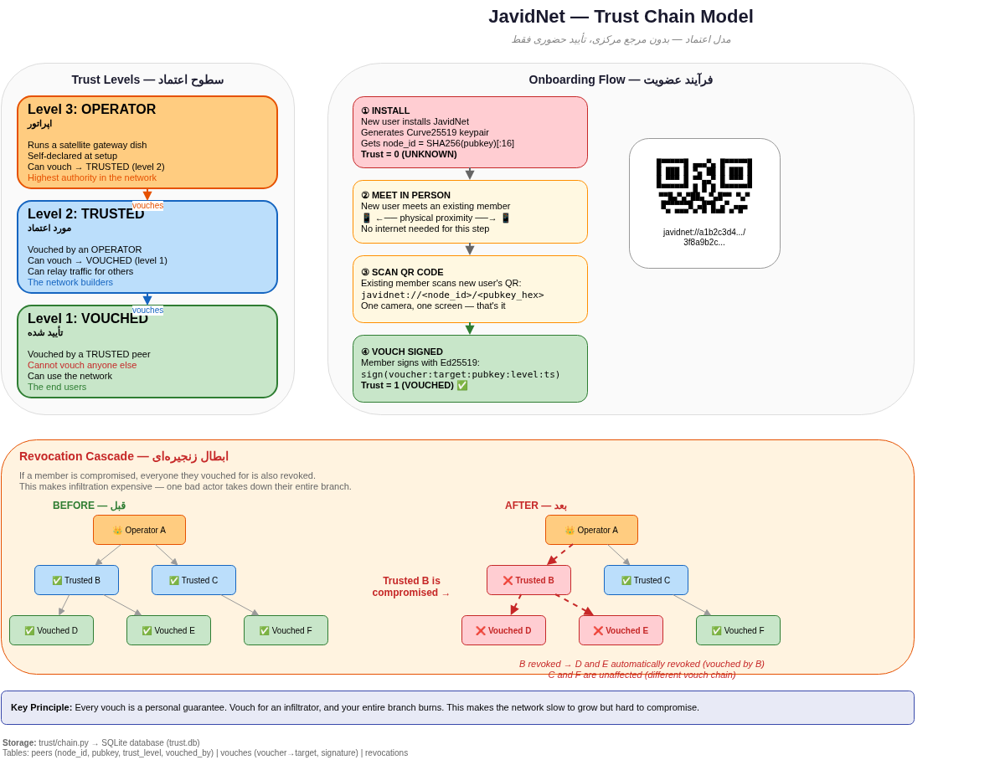
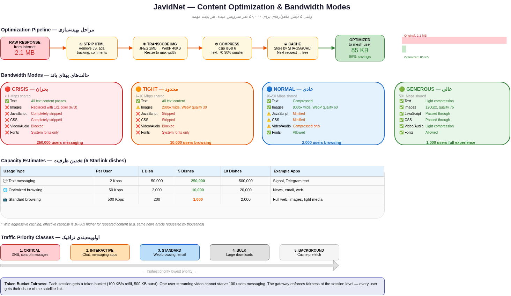
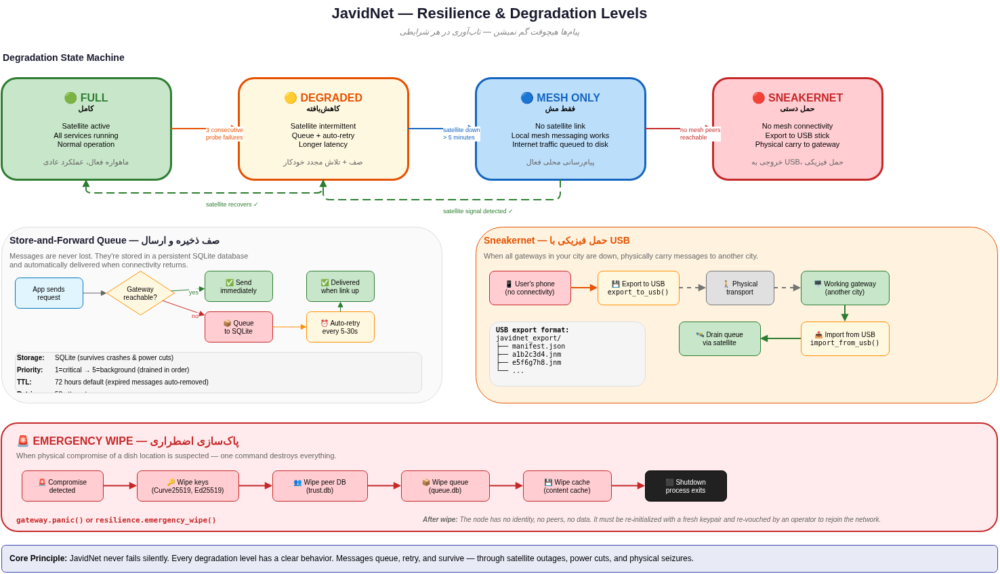

<div dir="rtl">

# جاویدنت - شبکه مش استارلینک

**اینترنت موازی ساخته شده از دیش‌های ماهواره‌ای و رادیوهای مش**

[]()

**[English](STARLINK_MESHNETWORK_README.md)**

---

## مفهوم

وقتی دولت اینترنت را قطع می‌کند، ابزارهای دور زدن فیلتر از کار می‌افتند. VPN، پروکسی، بریج تور، همه به زیرساخت دولت وابسته‌اند. لوله‌ها را ببندی، هر چیزی که داخل لوله‌ها کار می‌کند می‌میرد.

جاویدنت داخل لوله‌ها کار نمی‌کند.

جاویدنت یک **اینترنت موازی** است، جایگزین کامل شبکه داخلی، ساخته شده از دیش‌های استارلینک و رادیوهای مش محلی. ترافیک هیچگاه به زیرساخت دولت نمی‌رسد. چیزی برای مسدود کردن نیست، چیزی برای فیلتر نیست.

```
  ابزار دور زدن فیلتر:
    گوشی > [اینترنت دولت] > VPN > وب
             ^
             | اینو قطع می‌کنن
             \-- همه چیز خراب میشه

  جاویدنت:
    گوشی > [رادیو مش] > [دیش استارلینک] > وب
             ^
             | اینترنت دولت اصلاً استفاده نمیشه
             \-- چیزی برای قطع کردن نیست
```

## معماری سیستم



معماری سه منطقه دارد:

**اینترنت آزاد** - وب‌سایت‌ها، سرویس‌های پیام‌رسانی (سیگنال، تلگرام)، اخبار، موتورهای جستجو، ایمیل. از طریق آپلینک ماهواره‌ای استارلینک قابل دسترسی. DNS از طریق Cloudflare DoH (1.1.1.1) حل می‌شود، هرگز از طریق resolver‌های داخلی.

**منطقه ماهواره‌ای** - دیش‌های استارلینک مخفی متصل به نودهای GATEWAY. هر دروازه اجرا می‌کند:
- مدیریت آپلینک ماهواره‌ای
- کش محتوا (دیسک ۲ ترابایت، LRU، ایندکس SHA-256)
- بهینه‌ساز محتوا برای فشرده‌سازی و تبدیل
- عدالت پهنای باند (سطل توکن به ازای هر نشست)
- حل‌کننده DNS (DoH به 1.1.1.1، کش با TTL ۵ دقیقه)
- پاک‌سازی اضطراری (نابودی تمام داده‌ها در صورت مشکوک شدن به حمله)

**منطقه مش** - شبکه رادیویی محلی از نودهای HOP و LEAF. نودهای HOP ترافیک را با Wi-Fi، BLE یا LoRa رله می‌کنند. نودهای LEAF دستگاه‌های کاربر نهایی هستند که پروکسی SOCKS5 روی `127.0.0.1:1080` اجرا می‌کنند. ترافیک در مش پرش می‌کند تا به GATEWAY برسد.

اینترنت دولت در هیچ نقطه‌ای استفاده نمی‌شود.

## جریان داده



یک درخواست وب از این مراحل عبور می‌کند:

1. برنامه درخواست را به پروکسی SOCKS5 محلی (127.0.0.1:1080) ارسال می‌کند
2. پروکسی رمزگذاری می‌کند و به نود مش ارسال می‌کند
3. نود مش از طریق نودهای HOP به سمت GATEWAY مسیریابی می‌کند
4. GATEWAY کش محتوا را بررسی می‌کند - اگر کش شده، فورا برمی‌گرداند
5. اگر کش نشده، GATEWAY از اینترنت از طریق ماهواره استارلینک دریافت می‌کند
6. پاسخ بهینه‌سازی می‌شود (فشرده، تصاویر تبدیل، اسکریپت‌ها حذف)
7. پاسخ بهینه‌سازی شده از طریق مش به کاربر برمی‌گردد

## نقش‌ها

| نقش | کار | سخت‌افزار |
|-----|-----|----------|
| **LEAF** | کاربر نهایی. پروکسی SOCKS5 روی `127.0.0.1:1080` | هر گوشی/لپ‌تاپ |
| **HOP** | ترافیک را بین نودها رله می‌کند. برد مش را گسترش می‌دهد | هر دستگاه با Wi-Fi |
| **GATEWAY** | دیش استارلینک دارد. خروجی به اینترنت واقعی | RPi/رایانه + دیش استارلینک |

**تصمیمات طراحی کلیدی:**

- **بدون مسیریابی پیازی.** کل شبکه برای دولت نامرئی است چون ترافیک هرگز وارد زیرساخت آنها نمی‌شود.
- **بدون ترنسپورت قابل اتصال.** چیزی برای مخفی کردن نیست، DPI وجود ندارد چون ستون فقرات دولتی برای بازرسی وجود ندارد.
- **بدون سرورهای دایرکتوری.** همتاها از طریق بیکن‌های رادیویی محلی (UDP multicast، BLE، LoRa) یکدیگر را کشف می‌کنند.
- **بدون گواهینامه.** اعتماد از طریق تایید فیزیکی ساخته می‌شود - اسکن QR کد حضوری برای پیوستن به شبکه.

## مدل زنجیره اعتماد



جاویدنت هیچ مرجع مرکزی ندارد. اعتماد نفر به نفر از طریق شبکه اعتماد گسترش می‌یابد:

| سطح | نام | چگونه به دست می‌آید | چه کاری می‌تواند انجام دهد |
|-----|-----|-------------------|--------------------------|
| ۳ | اپراتور | دیش دروازه ماهواره‌ای داشته باشد | تایید دیگران تا سطح مورد اعتماد |
| ۲ | مورد اعتماد | تایید شده توسط اپراتور | تایید دیگران تا سطح تایید شده، رله ترافیک |
| ۱ | تایید شده | تایید شده توسط همتای مورد اعتماد | استفاده از شبکه |
| ۰ | ناشناخته | حالت پیش‌فرض | می‌تواند بیکن‌ها را ببیند اما نمی‌تواند ترافیک مسیریابی کند |

**عضویت:** یه عضو فعلی رو حضوری ببین. QR کدت رو اسکن کنه. عضو شدی. بدون اپ‌استور، بدون پیامک، بدون ایمیل.

**ابطال آبشاری:** اگر یک عضو لو برود، هر کسی که تایید کرده بود هم ابطال می‌شود. این نفوذ را گران می‌کند، چون یک عامل بد کل شاخه خود را از بین می‌برد.

## بهینه‌سازی محتوا و حالت‌های پهنای باند



وقتی ۵ دیش استارلینک یک شهر را سرویس می‌دهد، هر بایت مهم است:

| حالت | چه چیزی عبور می‌کند | چه کسی بهره می‌برد |
|------|---------------------|-------------------|
| **بحران** | فقط متن. بدون تصویر، بدون JS، بدون ویدیو | ۲۵۰,۰۰۰ کاربر پیام‌رسانی |
| **تنگ** | متن + تصاویر ریز (200px، کیفیت ۳۰٪). بدون JS | ۱۰,۰۰۰ کاربر مرور |
| **عادی** | مرور فشرده. تصاویر در 800px، کیفیت ۶۰٪ | ۲,۰۰۰ کاربر مرور |
| **سخاوتمند** | فشرده‌سازی سبک. تجربه تقریبا عادی | ۱,۰۰۰ کاربر |

کش محتوای دروازه ضریب افزایش پهنای باند است. وقتی ۱۰,۰۰۰ نفر همان مقاله را می‌خواهند، فقط یک نسخه از لینک ماهواره‌ای عبور می‌کند.

## تاب‌آوری و تخریب تدریجی



وقتی همه چیز خراب بشه چه اتفاقی می‌افتد؟

| سطح | وضعیت | جاویدنت چکار می‌کنه |
|-----|-------|---------------------|
| **کامل** | ماهواره فعال | عملکرد عادی |
| **کاهش** | ماهواره قطع و وصل | صف + تلاش مجدد خودکار |
| **فقط مش** | بدون ماهواره | پیام‌رسانی محلی کار می‌کنه، اینترنت در صف |
| **دستی** | بدون مش | خروجی به USB، حمل فیزیکی به دروازه دیگر |

پیام‌ها هیچوقت گم نمیشن. توی صف پایدار (دیتابیس SQLite) می‌مونن و وقتی ارتباط برگشت خودکار ارسال میشن.

**پاک‌سازی اضطراری:** اگر مشکوک به حمله فیزیکی بشید، یک دستور تمام کلیدها، داده‌های همتا، زنجیره‌های اعتماد، صف پیام و کش را نابود می‌کند.

## چرا نه ابزار دور زدن فیلتر؟

| | ابزار دور زدن (VPN/Tor) | جاویدنت |
|---|---|---|
| **از اینترنت دولت استفاده می‌کند** | بله | نه |
| **در قطعی از کار می‌افتد** | بله | نه |
| **قابل DPI** | بله | نامربوط، ترافیک دولتی نداریم |
| **نیاز به بریج/رله خارج** | بله | نه |
| **با صفر اینترنت داخلی کار می‌کند** | نه | بله |
| **نیاز به سخت‌افزار فیزیکی** | نه | بله (دیش‌ها) |
| **مقیاس‌پذیری تا ۵۰ هزار+ کاربر** | متغیر | با کش، بله |

جاویدنت بهتر یا بدتر از ابزار دور زدن فیلتر نیست. مشکل **متفاوتی** را حل می‌کند: وقتی دور زدن فیلتر غیرممکن است چون خود اینترنت وجود ندارد.

## تخمین ظرفیت

| دیش | پیام‌رسانی | مرور بهینه | مرور عادی |
|-----|-----------|-----------|----------|
| ۱ | ۵۰,۰۰۰ کاربر | ۲,۰۰۰ کاربر | ۲۰۰ کاربر |
| ۵ | ۲۵۰,۰۰۰ کاربر | ۱۰,۰۰۰ کاربر | ۱,۰۰۰ کاربر |
| ۱۰ | ۵۰۰,۰۰۰ کاربر | ۲۰,۰۰۰ کاربر | ۲,۰۰۰ کاربر |

با فرض بهینه‌سازی تهاجمی محتوا و کش. اعداد واقعی به الگوی مصرف بستگی دارد.

**مشخصات استارلینک فرض شده:** حدود ۱۰۰ مگابیت دانلود، حدود ۲۰ مگابیت آپلود به ازای هر دیش. عملکرد واقعی استارلینک بسته به مکان، ازدحام و آب‌و‌هوا متفاوت است (معمولا ۵۰ تا ۲۰۰ مگابیت دانلود، ۱۰ تا ۲۰ مگابیت آپلود).

## پیاده‌سازی

پیاده‌سازی Python در دایرکتوری `starlink-meshnetwork/` قرار دارد. برای مستندات کد، نصب و راهنمای استفاده به [starlink-meshnetwork/README.fa.md](starlink-meshnetwork/README.fa.md) مراجعه کنید.

---

<div align="center">

**در تاریکی، یک چراغ کافیست.**

</div>

</div>
