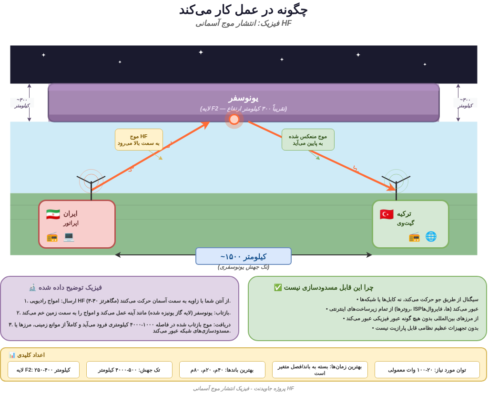
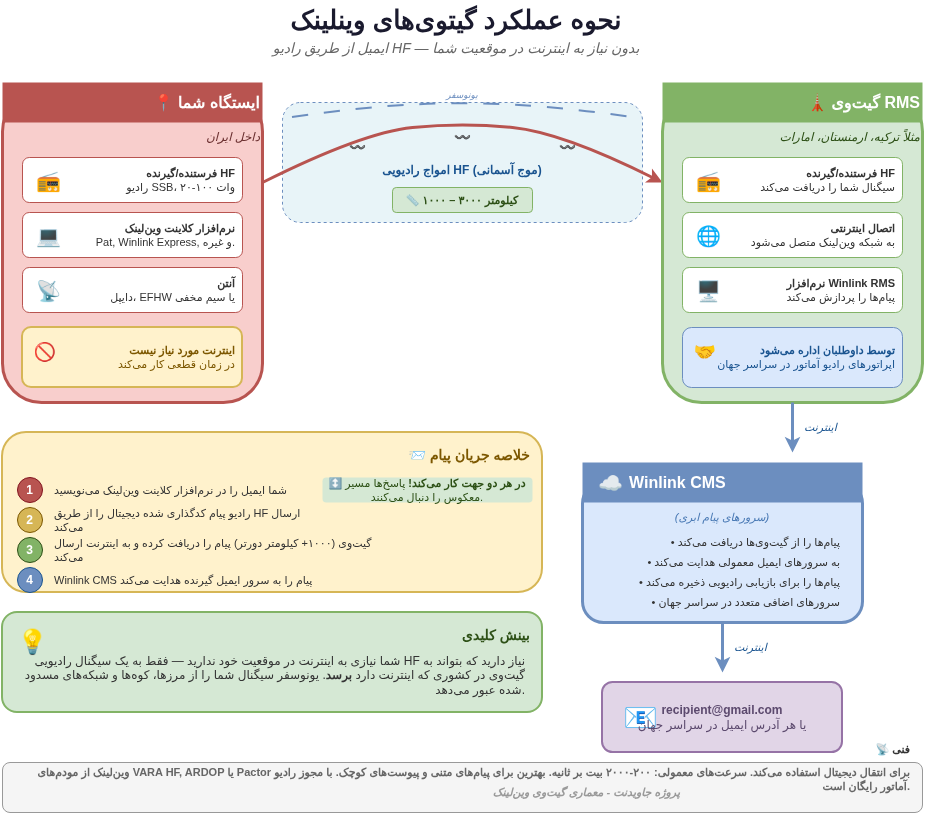
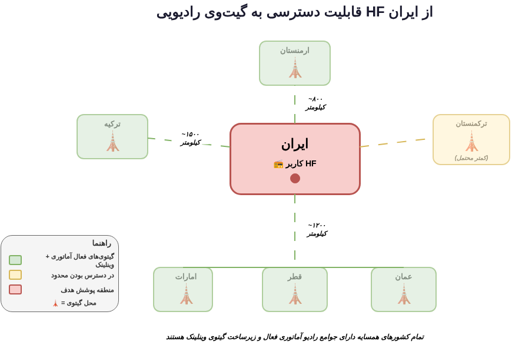
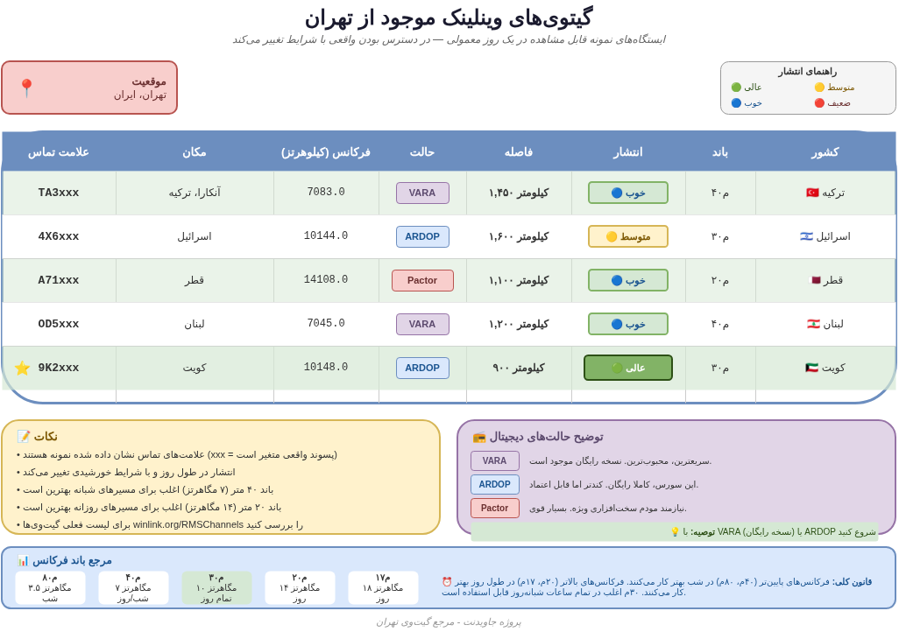
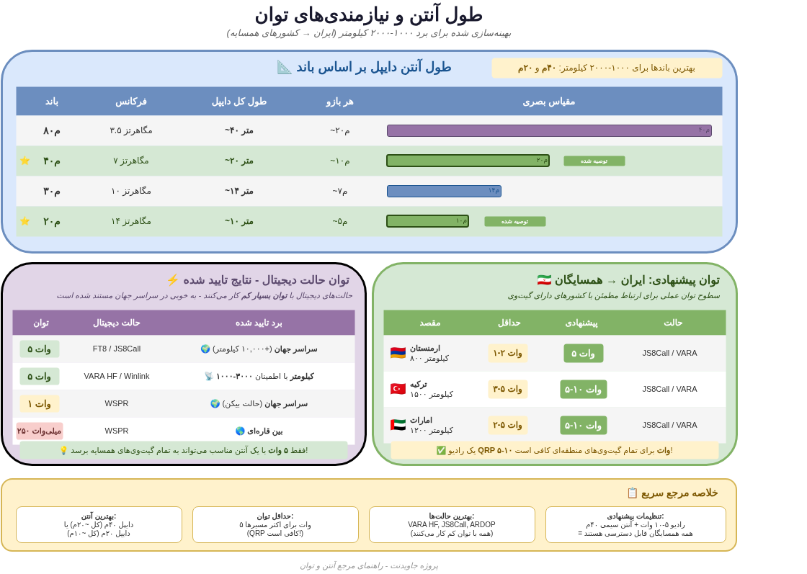
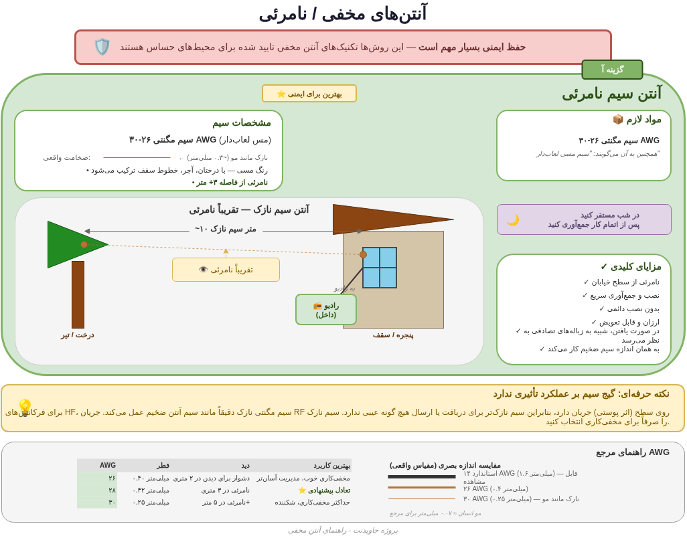
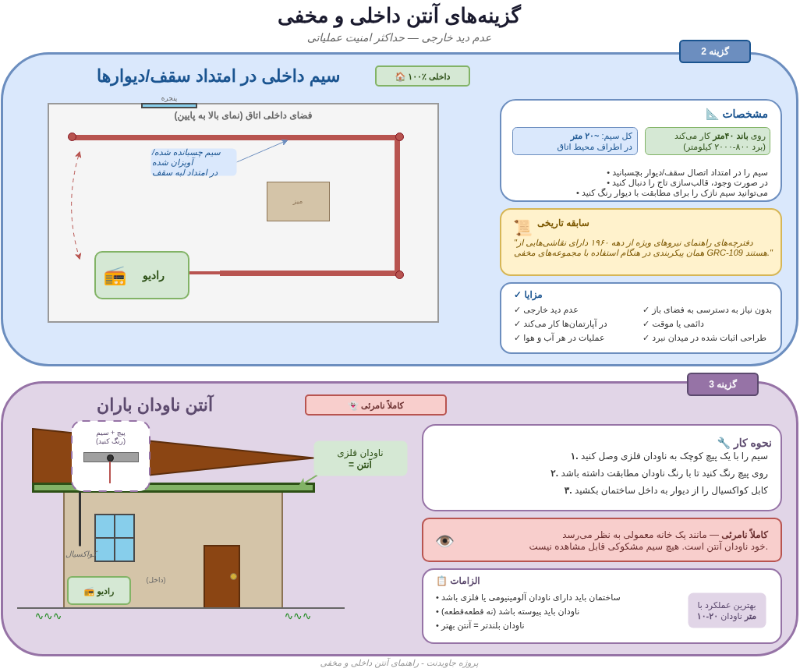
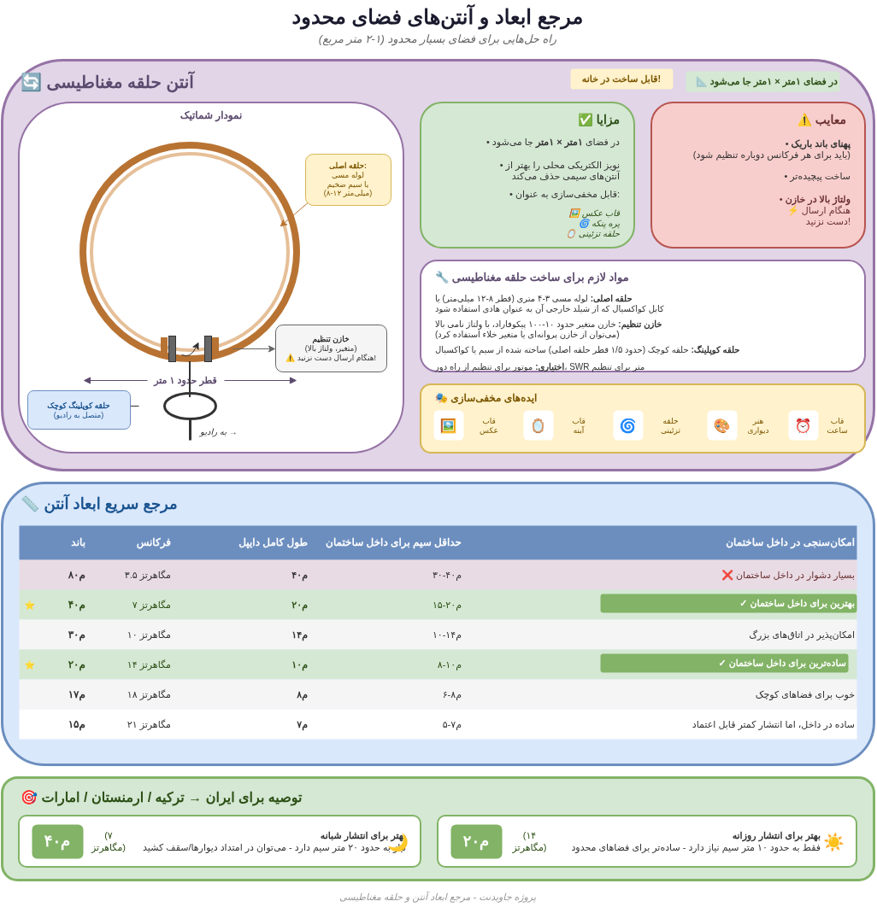
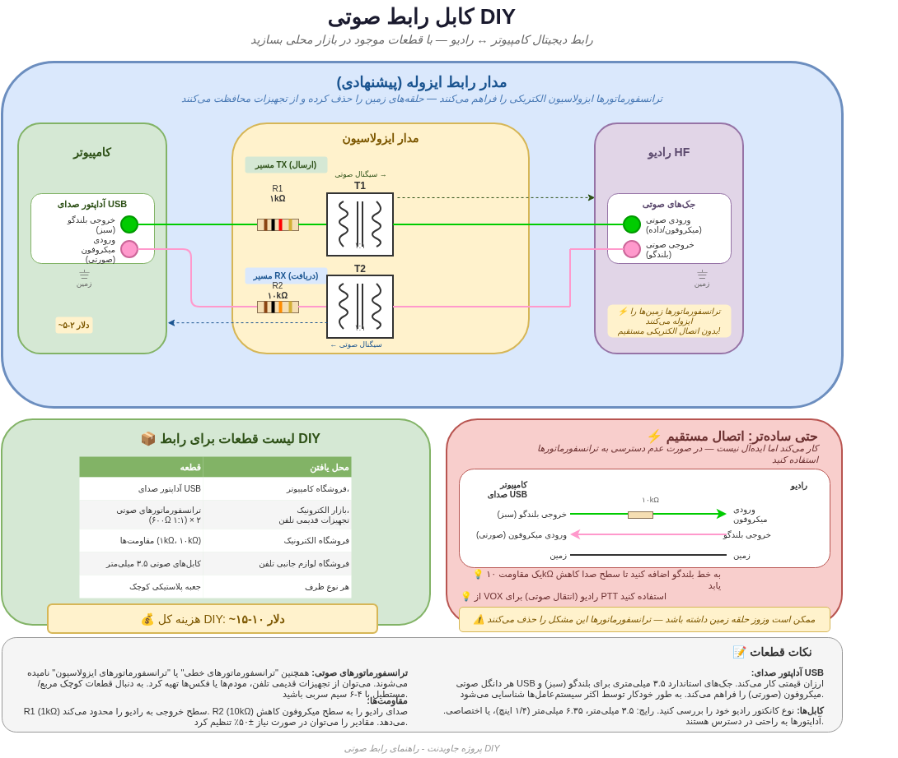
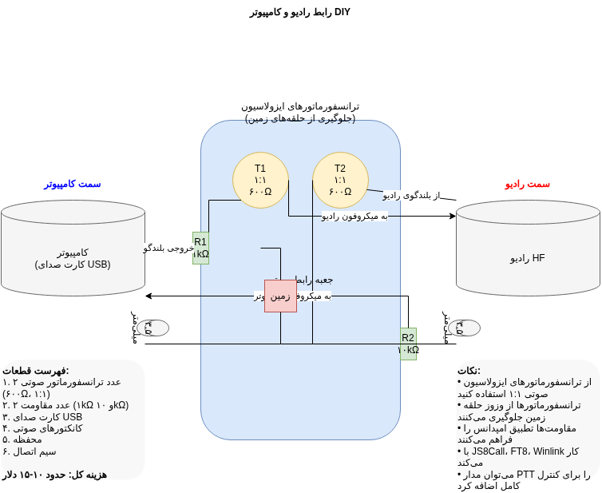

# جاویدنت - ارتباط رادیو HF

**ارسال ایمیل و پیام از طریق رادیو موج کوتاه، بدون نیاز به اینترنت**

**[English](README.md)**

---

## این چیست؟

این پوشه شامل نمودارهای فنی و مواد مرجع برای استفاده از رادیو HF (فرکانس بالا) به عنوان کانال ارتباطی وقتی دسترسی به اینترنت کاملا قطع شده است.

رادیو HF کانال پشتیبان جاویدنت است. در حالی که شبکه مش استارلینک دسترسی اینترنت بلادرنگ فراهم می‌کند، رادیو HF یک کانال ارتباط متنی با پهنای باند کم اما بسیار مقاوم فراهم می‌کند که حتی وقتی دیش‌های ماهواره‌ای مصادره یا پارازیت شوند کار می‌کند.

نکته کلیدی: نیازی به دروازه داخل کشور ندارید. به دروازه‌ای نیاز دارید که با سیگنال رادیویی قابل دسترسی باشد. امواج رادیو HF از یونسفر بازتاب می‌شوند و ۱۰۰۰ تا ۴۰۰۰ کیلومتر دورتر فرود می‌آیند، از مرزها، کوه‌ها و بلاک‌های شبکه عبور می‌کنند بدون اینکه هیچ زیرساخت زمینی را لمس کنند.

## انتشار موج آسمانی چگونه کار می‌کند

امواج رادیویی HF (۳ تا ۳۰ مگاهرتز) از آنتن با زاویه‌ای به سمت آسمان حرکت می‌کنند. یونسفر (به طور خاص لایه F2، یک لایه گاز یونیزه شده در ارتفاع تقریبی ۳۰۰ کیلومتر) مانند آینه عمل می‌کند و امواج را به سمت زمین برمی‌گرداند. موج بازتاب شده ۱۰۰۰ تا ۴۰۰۰ کیلومتر دورتر فرود می‌آید، کاملا از هر مانع زمینی، مرز یا بلاک شبکه عبور می‌کند.

این فیزیک اولیه رادیو است که از دهه ۱۹۲۰ به خوبی شناخته شده. بدون تجهیزات پارازیت درجه نظامی که کل طیف HF را پوشش دهد قابل مسدود شدن نیست، که روی منطقه بزرگ غیرعملی است.

**اعداد کلیدی:**

| پارامتر | مقدار |
|---------|-------|
| ارتفاع لایه F2 | ۲۵۰ تا ۴۰۰ کیلومتر |
| برد تک پرش | ۵۰۰ تا ۴۰۰۰ کیلومتر |
| بهترین باندها | 40m (۷ مگاهرتز)، 20m (۱۴ مگاهرتز)، 80m (۳.۵ مگاهرتز) |
| بهترین زمان | بسته به باند و فصل متفاوت |
| توان مورد نیاز | ۵ تا ۱۰۰ وات معمولی |

## معماری دروازه Winlink

Winlink یک سیستم عملیاتی موجود است که اپراتورهای رادیو آماتور در سراسر جهان از آن استفاده می‌کنند. ایمیل از طریق رادیو HF فراهم می‌کند.

**نحوه کار:**

1. ایمیل را در نرم‌افزار کلاینت Winlink (مثل Pat، Winlink Express) می‌نویسید
2. رادیو پیام کدگذاری شده دیجیتال را از طریق موج آسمانی HF ارسال می‌کند
3. دروازه Winlink RMS (بیش از ۱۰۰۰ کیلومتر دورتر، در کشوری که اینترنت دارد) سیگنال شما را دریافت می‌کند
4. دروازه آن را به Winlink CMS (سرورهای پیام ابری) از طریق اینترنت ارسال می‌کند
5. Winlink CMS پیام را به آدرس ایمیل معمولی گیرنده هدایت می‌کند

پاسخ‌ها مسیر معکوس را طی می‌کنند. اپراتور دروازه یک اپراتور رادیو آماتور داوطلب است.

**جزئیات فنی:** Winlink از مودم‌های VARA HF، ARDOP یا Pactor برای ارسال دیجیتال استفاده می‌کند. سرعت معمول: ۲۰۰ تا ۲۰۰۰ بیت بر ثانیه. بهترین کاربرد برای پیام متنی و پیوست‌های کوچک. استفاده با مجوز رادیو آماتور رایگان است.

## دسترسی به دروازه‌ها از ایران

همه کشورهای همسایه جوامع فعال رادیو آماتور و زیرساخت دروازه Winlink دارند:

| کشور | فاصله از تهران | وضعیت |
|------|---------------|-------|
| ارمنستان | حدود ۸۰۰ کیلومتر | دروازه‌های فعال |
| ترکیه | حدود ۱۵۰۰ کیلومتر | دروازه‌های فعال |
| امارات | حدود ۱۲۰۰ کیلومتر | دروازه‌های فعال |
| قطر | حدود ۱۱۰۰ کیلومتر | دروازه‌های فعال |
| کویت | حدود ۹۰۰ کیلومتر | دروازه‌های فعال |
| عمان | حدود ۱۲۰۰ کیلومتر | دروازه‌های فعال |
| ترکمنستان | حدود ۸۰۰ کیلومتر | دسترسی محدود |

همه این فواصل کاملا در محدوده تک‌پرش موج آسمانی روی باندهای 40m و 20m هستند.

## دروازه‌های موجود از تهران

نمونه دروازه‌های Winlink RMS قابل مشاهده از تهران در یک روز معمولی (دسترسی واقعی با شرایط انتشار تغییر می‌کند):

| علامت خطاب | مکان | فرکانس | حالت | فاصله | باند |
|-----------|------|---------|------|-------|------|
| TA3xxx | آنکارا، ترکیه | 7083.0 kHz | VARA | ۱,۴۵۰ km | 40m |
| 4X6xxx | اسرائیل | 10144.0 kHz | ARDOP | ۱,۶۰۰ km | 30m |
| A71xxx | قطر | 14108.0 kHz | Pactor | ۱,۱۰۰ km | 20m |
| OD5xxx | لبنان | 7045.0 kHz | VARA | ۱,۲۰۰ km | 40m |
| 9K2xxx | کویت | 10148.0 kHz | ARDOP | ۹۰۰ km | 30m |

**نکات:** علامت‌های خطاب نمایش داده شده نمونه هستند (پسوندهای واقعی متفاوت است). انتشار در طول روز و با شرایط خورشیدی تغییر می‌کند. باند 40m (۷ مگاهرتز) اغلب شب‌ها بهتر کار می‌کند. باند 20m (۱۴ مگاهرتز) اغلب روزها بهتر کار می‌کند.

## طول آنتن و نیازمندی‌های توان

### طول آنتن دوقطبی بر حسب باند

| باند | فرکانس | طول کل دوقطبی | هر بازو |
|------|---------|---------------|---------|
| 80m | ۳.۵ مگاهرتز | حدود ۴۰ متر | حدود ۲۰ متر |
| 40m | ۷ مگاهرتز | حدود ۲۰ متر | حدود ۱۰ متر |
| 30m | ۱۰ مگاهرتز | حدود ۱۴ متر | حدود ۷ متر |
| 20m | ۱۴ مگاهرتز | حدود ۱۰ متر | حدود ۵ متر |

بهترین باندها برای برد ۱۰۰۰ تا ۲۰۰۰ کیلومتر: **40m و 20m**.

### نیازمندی‌های توان

حالت‌های دیجیتال با توان بسیار کم کار می‌کنند. این در سراسر جهان مستند شده:

| توان | حالت دیجیتال | برد تایید شده |
|------|-------------|--------------|
| ۵ وات | FT8 / JS8Call | جهانی (بیش از ۱۰,۰۰۰ کیلومتر) |
| ۵ وات | VARA HF / Winlink | ۱۰۰۰ تا ۳۰۰۰ کیلومتر به طور قابل اعتماد |
| ۱ وات | WSPR | جهانی (حالت بیکن) |
| ۲۵۰ میلی‌وات | WSPR | بین قاره‌ای |

یک رادیو QRP ۵ تا ۱۰ وات برای تمام دروازه‌های منطقه‌ای کافی است.

## آنتن‌های مخفی / نامرئی

در محیط‌های حساس، قابل مشاهده بودن آنتن یک نگرانی حیاتی امنیتی است. اینها تکنیک‌های آنتن مخفی تایید شده هستند:

### گزینه A: آنتن سیمی نامرئی (بهترین برای امنیت)

از سیم مغناطیسی ۲۶ تا ۳۰ AWG (مس روکش لعاب) استفاده می‌کند. این سیم به نازکی مو است (حدود ۰.۳ میلی‌متر)، رنگ مسی دارد و با درختان، آجر و خط بام ترکیب می‌شود. از فاصله ۳ متر به بالا نامرئی است.

**چرا سیم نازک کار می‌کند:** برای فرکانس‌های HF، سیم مغناطیسی نازک دقیقا مثل سیم آنتن ضخیم عمل می‌کند. جریان RF روی سطح هادی جاری می‌شود (اثر پوستی)، بنابراین سیم نازک‌تر هیچ عیبی برای دریافت یا ارسال ندارد. سیم نازک را فقط برای مخفی‌کاری انتخاب کنید.

**هزینه:** حدود ۵ دلار برای بیش از ۵۰ متر سیم از هر مغازه الکترونیک.

## آنتن‌های داخلی و پنهان

### گزینه B: سیم داخلی در امتداد سقف/دیوارها (۱۰۰٪ داخلی)

حدود ۲۰ متر سیم نازک را در امتداد لبه سقف یا محل اتصال دیوار اتاق بکشید. با نوار چسب در امتداد قرنیز بچسبانید یا روی آن رنگ بزنید تا با دیوار هماهنگ شود. روی باند 40m کار می‌کند (برد ۸۰۰ تا ۲۰۰۰ کیلومتر).

صفر دید خارجی. در آپارتمان کار می‌کند. عملکرد در هر آب و هوا. این پیکربندی سابقه تاریخی دارد: کتاب‌های راهنمای نیروهای ویژه دهه ۱۹۶۰ دقیقا همین تنظیمات را با رادیوهای مخفی GRC-109 مستند کرده‌اند.

### گزینه C: آنتن ناودانی (کاملا نامرئی)

سیمی را با یک پیچ کوچک به ناودان فلزی متصل کنید. روی پیچ رنگ بزنید تا با رنگ ناودان هماهنگ شود. کابل کواکسیال را از دیوار به داخل ساختمان ببرید. خود ناودان آنتن است.

کاملا نامرئی - مثل یک خانه معمولی به نظر می‌رسد. نیاز به ناودان‌های آلومینیومی یا فلزی، پیوسته (نه تکه‌ای). بهترین عملکرد با ۱۰ تا ۲۰ متر ناودان.

## آنتن حلقه مغناطیسی

آنتن‌های حلقه مغناطیسی جایگزین‌های فشرده‌ای هستند وقتی آنتن‌های سیمی عملی نیستند. یک حلقه با محیط ۱ تا ۳ متر با یک خازن تنظیم می‌تواند روی چندین باند HF کار کند.

**مزایا:** بسیار فشرده، قابل استفاده در داخل، جهت‌دار.

**معایب:** پهنای باند باریک (نیاز به تنظیم مجدد برای هر تغییر فرکانس)، بازده کمتر از آنتن‌های سیمی تمام‌اندازه، نیاز به خازن متغیر.

مناسب برای فقط دریافت یا عملکرد QRP کم‌توان. برای ارتباط Winlink قابل اعتماد، آنتن سیمی (حتی داخلی) عموما ترجیح داده می‌شود.

## رابط صوتی DIY

برای استفاده از حالت‌های دیجیتال (VARA، ARDOP، JS8Call، FT8)، باید رایانه را به رادیو متصل کنید. این کار با یک کابل رابط صوتی ساده انجام می‌شود.

### مدار رابط ایزوله (توصیه شده)

روش توصیه شده از دو ترانسفورماتور ایزولاسیون صوتی ۱:۱ (۶۰۰ اهم) بین کارت صوت رایانه و رادیو استفاده می‌کند. ترانسفورماتورها از هوم حلقه زمین جلوگیری می‌کنند.

**لیست قطعات:**

| قطعه | کاربرد |
|------|--------|
| ۲ عدد ترانسفورماتور صوتی (۱:۱، ۶۰۰ اهم) | ایزولاسیون |
| ۲ عدد مقاومت (۱ کیلو اهم + ۱۰ کیلو اهم) | تطبیق امپدانس |
| ۱ عدد کارت صوت USB | ورودی/خروجی صوت رایانه |
| کانکتورهای صوتی (۳.۵ میلی‌متر) | اتصالات کابل |
| جعبه + سیم اتصال | مونتاژ |

**هزینه کل:** حدود ۱۰ تا ۱۵ دلار

جایگزین‌های تجاری: Digirig (حدود ۵۰ دلار)، SignaLink USB (حدود ۱۰۰ دلار).

## شروع کار - حداقل تجهیزات

| مورد | کاربرد | هزینه تقریبی |
|------|--------|-------------|
| فرستنده-گیرنده HF (۵ تا ۱۰ وات QRP) | ارتباط رادیویی | ۱۵۰ تا ۵۰۰ دلار |
| سیم مغناطیسی (۲۸ AWG، ۲۰ متر) | آنتن مخفی | ۵ دلار |
| کارت صوت USB | رابط صوتی | ۵ تا ۱۰ دلار |
| ۲ عدد ترانسفورماتور صوتی | ایزولاسیون | ۵ دلار |
| کلاینت Winlink (Pat) | نرم‌افزار ایمیل | رایگان |
| رایانه یا Raspberry Pi | اجرای Winlink | دستگاه موجود |

مجموع حداقل راه‌اندازی: کمتر از ۲۰۰ دلار با یک رادیو QRP دست دوم.

---

**در تاریکی، یک چراغ کافیست.**

