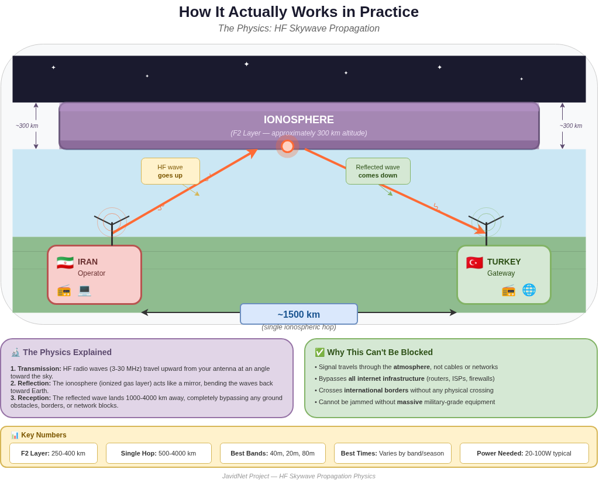
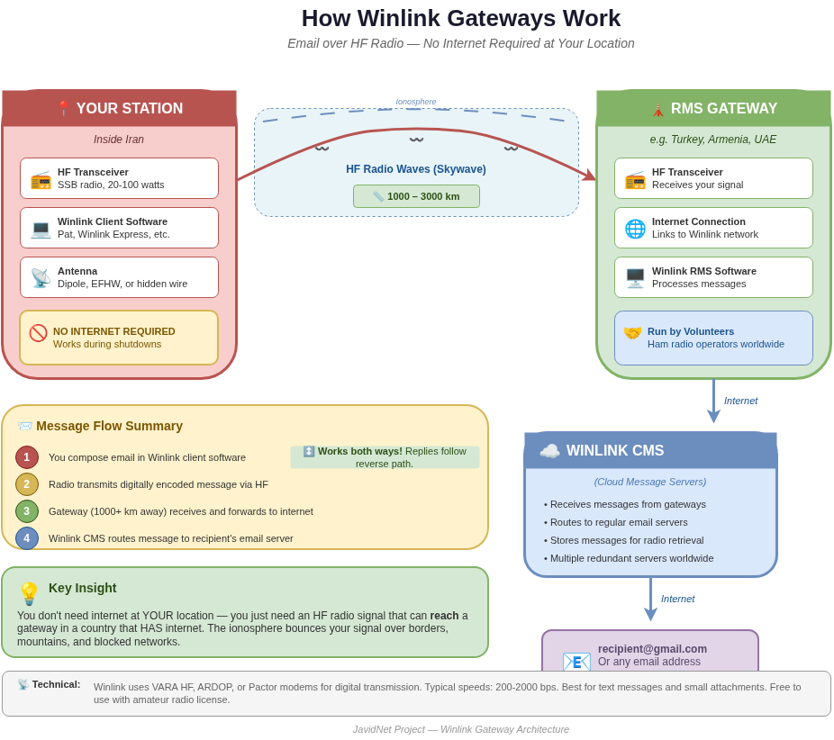
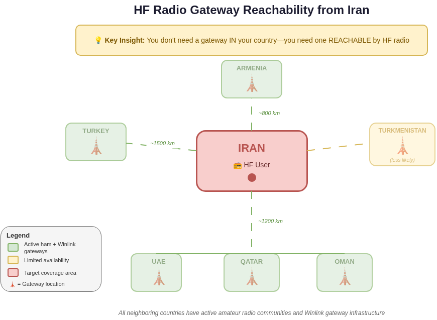
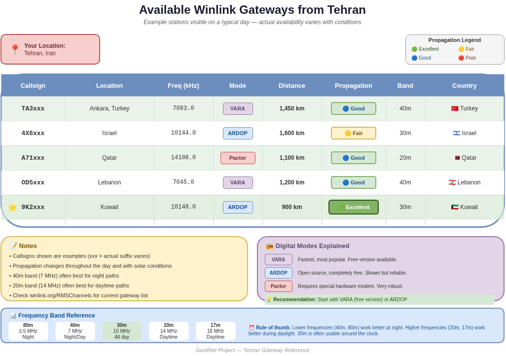
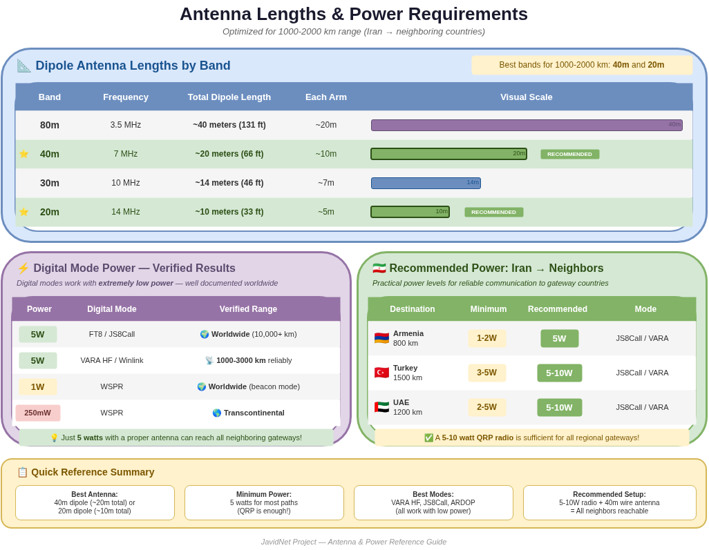
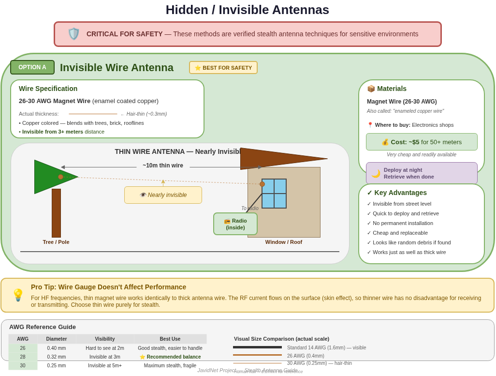
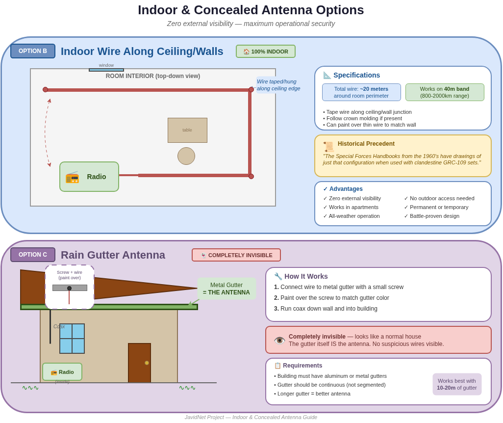
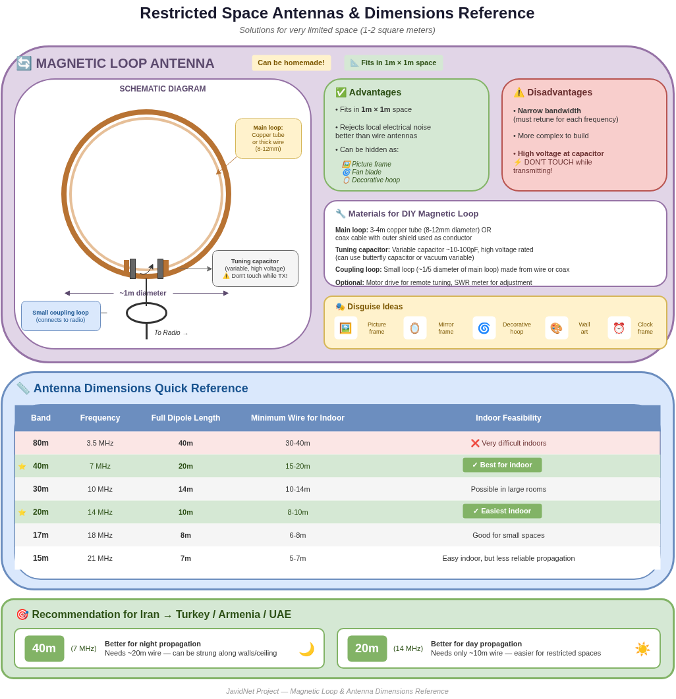
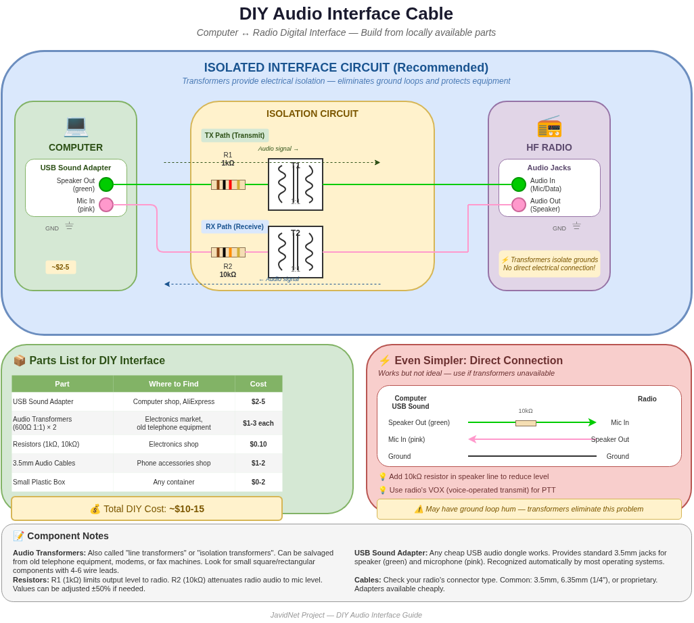
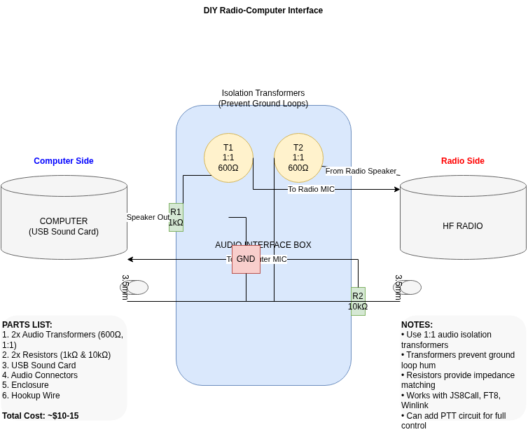

# JavidNet - HF Radio Communication

**Sending email and text over shortwave radio, no internet required.**

**[فارسی (Persian)](README.fa.md)**

---

## What is this?

This folder contains technical diagrams and reference material for using HF (High Frequency) radio as a communication channel when internet access is completely unavailable.

HF radio is the backup channel for JavidNet. While the primary Starlink mesh network provides real-time internet access, HF radio provides a low-bandwidth but extremely resilient text communication channel that works even when satellite dishes are seized or jammed.

The key insight: you do not need a gateway inside your country. You need a gateway reachable by radio signal. HF radio waves bounce off the ionosphere and land 1000-4000 km away, crossing borders, mountains, and network blocks without touching any ground infrastructure.

## How Skywave Propagation Works

HF radio waves (3-30 MHz) travel upward from the antenna at an angle toward the sky. The ionosphere (specifically the F2 layer, an ionised gas layer at approximately 300 km altitude) acts like a mirror, bending the waves back toward Earth. The reflected wave lands 1000-4000 km away, completely bypassing any ground obstacles, borders, or network blocks.

This is basic radio physics, well understood since the 1920s. It cannot be blocked without military-grade jamming equipment covering the entire HF spectrum, which is impractical over a large area.

**Key numbers:**

| Parameter | Value |
|-----------|-------|
| F2 Layer altitude | 250-400 km |
| Single hop range | 500-4000 km |
| Best bands | 40m (7 MHz), 20m (14 MHz), 80m (3.5 MHz) |
| Best times | Varies by band and season |
| Power needed | 5-100W typical |

## Winlink Gateway Architecture

Winlink is an existing, operational system used by amateur radio operators worldwide. It provides email over HF radio.

**How it works:**

1. You compose an email in Winlink client software (Pat, Winlink Express, etc.)
2. Your radio transmits the digitally encoded message via HF skywave
3. A Winlink RMS gateway (1000+ km away, in a country that has internet) receives your signal
4. The gateway forwards it to Winlink CMS (Cloud Message Servers) via internet
5. Winlink CMS routes the message to the recipient's regular email address

Replies follow the reverse path. The gateway operator is a volunteer ham radio operator.

**Technical details:** Winlink uses VARA HF, ARDOP, or Pactor modems for digital transmission. Typical speeds: 200-2000 bps. Best suited for text messages and small attachments. Free to use with an amateur radio licence.

## Gateway Reachability from Iran

All neighbouring countries have active amateur radio communities and Winlink gateway infrastructure:

| Country | Distance from Tehran | Status |
|---------|---------------------|--------|
| Armenia | ~800 km | Active ham + Winlink gateways |
| Turkey | ~1500 km | Active ham + Winlink gateways |
| UAE | ~1200 km | Active ham + Winlink gateways |
| Qatar | ~1100 km | Active ham + Winlink gateways |
| Kuwait | ~900 km | Active ham + Winlink gateways |
| Oman | ~1200 km | Active ham + Winlink gateways |
| Turkmenistan | ~800 km | Limited availability |

All these distances are well within single-hop skywave range on the 40m and 20m bands.

## Available Gateways from Tehran

Example Winlink RMS gateways visible from Tehran on a typical day (actual availability varies with propagation conditions):

| Callsign | Location | Frequency | Mode | Distance | Band |
|----------|----------|-----------|------|----------|------|
| TA3xxx | Ankara, Turkey | 7083.0 kHz | VARA | 1,450 km | 40m |
| 4X6xxx | Israel | 10144.0 kHz | ARDOP | 1,600 km | 30m |
| A71xxx | Qatar | 14108.0 kHz | Pactor | 1,100 km | 20m |
| OD5xxx | Lebanon | 7045.0 kHz | VARA | 1,200 km | 40m |
| 9K2xxx | Kuwait | 10148.0 kHz | ARDOP | 900 km | 30m |

**Notes:** Callsigns shown are examples (actual suffixes vary). Propagation changes throughout the day and with solar conditions. The 40m band (7 MHz) often works best at night. The 20m band (14 MHz) often works best during daytime. Check winlink.org/RMSChannels for the current gateway list.

## Antenna Lengths and Power Requirements

### Dipole Antenna Lengths by Band

| Band | Frequency | Total dipole length | Each arm |
|------|-----------|-------------------|----------|
| 80m | 3.5 MHz | ~40 metres (131 ft) | ~20m |
| 40m | 7 MHz | ~20 metres (66 ft) | ~10m |
| 30m | 10 MHz | ~14 metres (46 ft) | ~7m |
| 20m | 14 MHz | ~10 metres (33 ft) | ~5m |

Best bands for 1000-2000 km range: **40m and 20m**.

### Power Requirements

Digital modes work with extremely low power. This is well documented worldwide:

| Power | Digital mode | Verified range |
|-------|-------------|---------------|
| 5W | FT8 / JS8Call | Worldwide (10,000+ km) |
| 5W | VARA HF / Winlink | 1000-3000 km reliably |
| 1W | WSPR | Worldwide (beacon mode) |
| 250mW | WSPR | Transcontinental |

**Recommended power for Iran to neighbouring countries:**

| Destination | Distance | Minimum | Recommended | Mode |
|-------------|----------|---------|-------------|------|
| Armenia (800 km) | 800 km | 1-2W | 5W | JS8Call / VARA |
| Turkey (1500 km) | 1500 km | 3-5W | 5-10W | JS8Call / VARA |
| UAE (1200 km) | 1200 km | 2-5W | 5-10W | JS8Call / VARA |

A 5-10 watt QRP radio is sufficient for all regional gateways.

## Hidden / Invisible Antennas

In sensitive environments, antenna visibility is a critical safety concern. These are verified stealth antenna techniques:

### Option A: Invisible Wire Antenna (best for safety)

Uses 26-30 AWG magnet wire (enamel coated copper). This wire is hair-thin (~0.3mm), copper coloured, and blends with trees, brick, and rooflines. Invisible from 3+ metres distance.

**How it works:** Run ~10m of thin wire from a window/roof to a tree or pole. Connect the other end to your radio. Deploy at night, retrieve when done.

**Why thin wire works:** For HF frequencies, thin magnet wire performs identically to thick antenna wire. The RF current flows on the surface of the conductor (skin effect), so thinner wire has no disadvantage for receiving or transmitting. Choose thin wire purely for stealth.

**Cost:** ~$5 for 50+ metres of wire from any electronics shop.

| AWG | Diameter | Visibility |
|-----|----------|-----------|
| 26 | 0.40 mm | Hard to see at 2m |
| 28 | 0.32 mm | Invisible at 3m (recommended) |
| 30 | 0.25 mm | Invisible at 5m+, fragile |

## Indoor and Concealed Antennas

### Option B: Indoor Wire Along Ceiling/Walls (100% indoor)

Run ~20 metres of thin wire along the ceiling edge or wall junction of a room. Tape it along the crown moulding or paint over it to match the wall. Works on the 40m band (800-2000 km range).

Zero external visibility. Works in apartments. All-weather operation. This configuration has historical precedent: the Special Forces Handbooks from the 1960s document exactly this setup with clandestine GRC-109 radio sets.

### Option C: Rain Gutter Antenna (completely invisible)

Connect a wire to a metal rain gutter with a small screw. Paint over the screw to match gutter colour. Run coax down the wall and into the building. The gutter itself IS the antenna.

Completely invisible - looks like a normal house. No suspicious wires visible. Requires aluminium or metal gutters, continuous (not segmented). Works best with 10-20m of gutter.

## Magnetic Loop Antennas

Magnetic loop antennas are compact alternatives when wire antennas are not practical. A loop of 1-3 metres circumference with a tuning capacitor can operate on multiple HF bands.

**Advantages:** Very compact, can be used indoors, directional (useful for both reception and avoiding detection).

**Disadvantages:** Narrow bandwidth (requires retuning for each frequency change), lower efficiency than full-size wire antennas, requires a variable capacitor.

Suitable for receive-only or low-power QRP operation. For reliable Winlink communication, a wire antenna (even indoor) is generally preferred.

## DIY Audio Interface

To use digital modes (VARA, ARDOP, JS8Call, FT8), you need to connect your computer to your radio. This can be done with a simple audio interface cable.

### Isolated Interface Circuit (recommended)

The recommended approach uses two 1:1 audio isolation transformers (600 ohm) between the computer sound card and the radio. The transformers prevent ground loop hum, which is a common problem with direct connections.

**Parts list:**

| Part | Purpose |
|------|---------|
| 2x audio transformers (1:1, 600 ohm) | Isolation |
| 2x resistors (1k ohm + 10k ohm) | Impedance matching |
| 1x USB sound card | Computer audio I/O |
| Audio connectors (3.5mm) | Cable connections |
| Enclosure + hookup wire | Assembly |

**Total cost:** ~$10-15

The transformers prevent ground loops. The resistors provide impedance matching. Works with JS8Call, FT8, Winlink (VARA/ARDOP).

For simpler setups, a direct cable connection (computer speaker out to radio mic, radio speaker to computer mic) also works but may have hum issues.

Commercial alternatives: Digirig (~$50), SignaLink USB (~$100). These are pre-built interfaces that do the same job.

## Getting Started - Minimum Equipment

| Item | Purpose | Approximate cost |
|------|---------|-----------------|
| HF transceiver (5-10W QRP) | Radio communication | $150-500 |
| Magnet wire (28 AWG, 20m) | Stealth antenna | $5 |
| USB sound card | Audio interface | $5-10 |
| 2x audio transformers | Isolation | $5 |
| Winlink client (Pat) | Email software | Free |
| Computer or Raspberry Pi | Running Winlink | Existing device |

Total minimum setup: under $200 with a used QRP radio.

## Diagram Source Files

All diagrams in this folder are created with [draw.io](https://app.diagrams.net/) and available in both English and Farsi:

| Diagram | English | Farsi |
|---------|---------|-------|
| HF Skywave Propagation | `hf_skywave_propagation.drawio` | `farsi/hf_skywave_propagation.drawio` |
| Winlink Gateway Architecture | `winlink_gateway_architecture.drawio` | `farsi/winlink_gateway_architecture.drawio` |
| HF Gateway Reachability | `hf_gateway_reach.drawio` | `farsi/hf_gateway_reach.drawio` |
| Antenna Power Reference | `antenna_power_reference.drawio` | `farsi/antenna_power_reference.drawio` |
| Hidden Antennas | `hidden_antennas.drawio` | `farsi/hidden_antennas.drawio` |
| Indoor Antennas | `indoor_antennas.drawio` | `farsi/indoor_antennas.drawio` |
| Magnetic Loop Dimensions | `magnetic_loop_dimensions.drawio` | `farsi/magnetic_loop_dimensions.drawio` |
| Tehran Gateways | `tehran_gateways.drawio` | `farsi/tehran_gateways.drawio` |
| DIY Audio Interface | `diy_audio_interface.drawio` | `farsi/diy_audio_interface.drawio` |
| Radio Interface Circuit | `circ-digrig.drawio` | `farsi/circ-digrig.drawio` |

---

In darkness, one light is enough.
